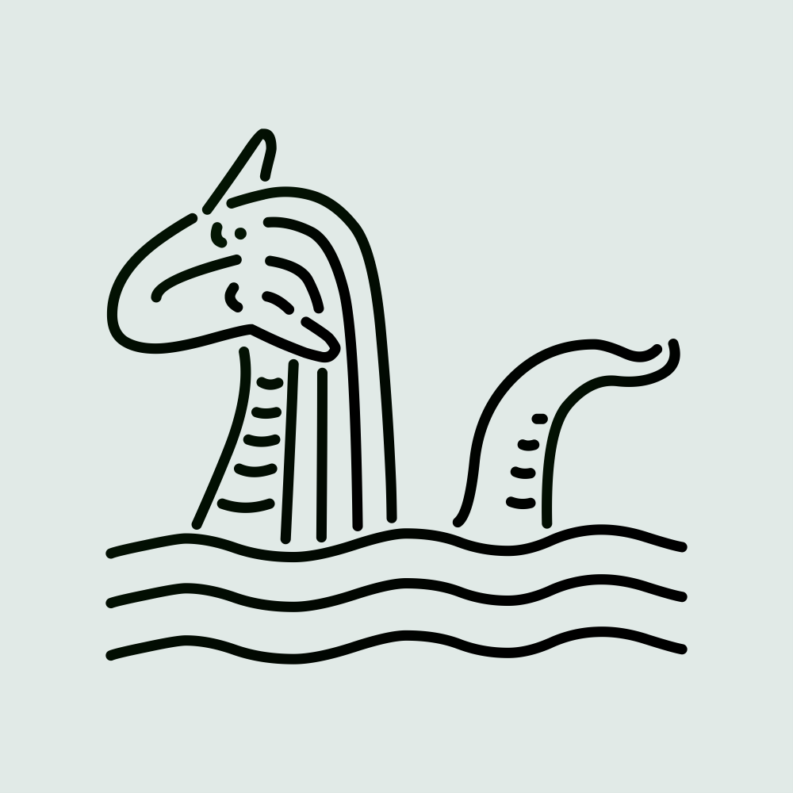

  

# Mitos y Drogas

Bienvenidos a **Mitos y Drogas**, una organización sin fines de lucro dedicada a ofrecer charlas, reuniones y guías de prevención de daños para la sociedad mexicana. Nuestro objetivo es educar y proporcionar información precisa y sin prejuicios sobre el uso de sustancias, fomentando un ambiente libre de estereotipos y discriminación.

## Nuestra Misión

En **Mitos y Drogas**, creemos en la importancia de la educación y la prevención para reducir los daños asociados con el uso de sustancias. Nuestro enfoque es inclusivo y respetuoso, buscando siempre proporcionar un espacio seguro para el diálogo y el aprendizaje.

## ¿Qué Hacemos?

- **Charlas Educativas:** Organizamos sesiones informativas sobre diversas sustancias y sus efectos, dirigidas a diferentes grupos de la comunidad.
- **Reuniones Comunitarias:** Creamos espacios de encuentro para compartir experiencias y conocimientos, promoviendo el apoyo mutuo.
- **Guías de Prevención:** Publicamos materiales educativos diseñados para prevenir los daños asociados con el uso de sustancias.

## Contáctanos

¡Nos encantaría saber de ti! Puedes ponerte en contacto con nosotros a través de las siguientes plataformas:

- **Correo Electrónico:** [contacto@mitosydrogas.org](mailto:contacto@mitosydrogas.org)
- **Twitter:** [@MitosyDrogas](https://twitter.com/MitosyDrogas)
- **Facebook:** [Mitos y Drogas](https://facebook.com/MitosyDrogas)
- **Instagram:** [@MitosyDrogas](https://instagram.com/MitosyDrogas)
- **Sitio Web:** [www.mitosydrogas.org](https://www.mitosydrogas.org)

---

  <i>"Educar para prevenir, prevenir para vivir"</i>

